# dilagent 🔍

**Agentic root cause analysis through hypothesis-driven debugging**

dilagent automates the tedious process of reproducing, diagnosing, and fixing bugs through systematic hypothesis testing and experimentation. It combines LLM agents with structured scientific methodology to identify root causes and validate fixes.

## How It Works

dilagent follows a structured, multi-stage approach to debugging:

### 1. 🔬 Reproduction Stage
First, dilagent attempts to reproduce the issue:
- Creates minimal reproducible test cases (`repro.ts`)
- Measures timing characteristics (performance, timeouts, race conditions)
- Documents setup requirements
- Asks clarifying questions when needed

### 2. 🧠 Hypothesis Generation  
Based on successful reproduction, dilagent generates targeted hypotheses:
- Analyzes reproduction data and codebase context
- Creates multiple hypotheses (H001, H002, H003...)
- Tailors hypotheses to the type of issue (performance, concurrency, logic)
- Outputs structured `hypotheses.json` for tracking

### 3. 🧪 Hypothesis Testing
Each hypothesis is tested in parallel:
- Independent testing in isolated worktrees
- Each hypothesis can result in:
  - ✅ **Proven**: Root cause identified
  - ❌ **Disproven**: Not the issue, move on
  - 🎯 **Diagnosed**: Issue understood but needs more work
  - ❓ **Inconclusive**: Requires additional data
- Counter-experiments validate findings

### 4. 💬 Interactive Exploration (Optional)
For complex issues requiring human insight:
- REPL-based interactive debugging session
- Agent-assisted exploration with full context
- Direct manipulation and testing

The process continues iteratively until the root cause is found and validated.

## System Architecture

### Overall Manager Flow


### Hypothesis Testing Loop


## Key Features

- **Automated Reproduction**: Generates minimal test cases from bug reports
- **Parallel Hypothesis Testing**: Tests multiple theories simultaneously in isolated environments
- **Counter-Experiment Validation**: Prevents false positives through negative testing
- **Interactive Fallback**: REPL mode for complex cases requiring human expertise
- **Evidence-Based**: Every conclusion backed by reproducible experiments
- **MCP Integration**: Leverages Model Context Protocol for tool orchestration

## Quick Start

```bash
# Install
npm install -g dilagent

# Stage 1: Reproduce an issue
dilagent manager repro --issue "Data inconsistency after concurrent updates"

# Stage 2: Generate hypotheses
dilagent manager generate-hypotheses

# Stage 3: Test hypotheses in parallel
dilagent manager run-hypotheses

# Or run the full pipeline
dilagent analyze --auto

# Interactive debugging if needed
dilagent manager repl
```

## Requirements

- Bun 1.2+
- Git (for worktree isolation)
- Local LLM tool (`claude` or `codex`)