# dilagent 🔍

**Agentic root cause analysis through hypothesis-driven debugging**

dilagent automates the tedious process of reproducing, diagnosing, and fixing bugs through systematic hypothesis testing and experimentation. It combines LLM agents with structured scientific methodology to identify root causes and validate fixes.

## How It Works

dilagent follows a structured, multi-stage approach to debugging:

### 1. 🔬 Reproduction Stage
First, dilagent attempts to reproduce the issue:
- Creates minimal reproducible test cases (`repro.ts`)
- Measures timing characteristics (performance, timeouts, race conditions)
- Documents setup requirements
- Asks clarifying questions when needed

### 2. 🧠 Hypothesis Generation  
Based on successful reproduction, dilagent generates targeted hypotheses:
- Analyzes reproduction data and codebase context
- Creates multiple hypotheses (H001, H002, H003...)
- Tailors hypotheses to the type of issue (performance, concurrency, logic)
- Outputs structured `hypotheses.json` for tracking

### 3. 🧪 Hypothesis Testing
Each hypothesis is tested in parallel:
- Independent testing in isolated worktrees
- Each hypothesis can result in:
  - ✅ **Proven**: Root cause identified
  - ❌ **Disproven**: Not the issue, move on
  - ❓ **Inconclusive**: Requires additional data
- Counter-experiments validate findings

### 4. 💬 Interactive Exploration (Optional)
For complex issues requiring human insight:
- REPL-based interactive debugging session
- Agent-assisted exploration with full context
- Direct manipulation and testing

The process continues iteratively until the root cause is found and validated.

## System Architecture

### Overall Manager Flow


### Hypothesis Testing Loop


## Key Features

- **Automated Reproduction**: Generates minimal test cases from bug reports
- **Parallel Hypothesis Testing**: Tests multiple theories simultaneously in isolated environments
- **Counter-Experiment Validation**: Prevents false positives through negative testing
- **Interactive Fallback**: REPL mode for complex cases requiring human expertise
- **Evidence-Based**: Every conclusion backed by reproducible experiments
- **MCP Integration**: Leverages Model Context Protocol for tool orchestration

## Workflow Stages & Key Files

### Stage 0: Setup
```bash
dilagent manager setup --working-directory ./debug-session --context-directory ./my-project
```
- Creates `.dilagent/` directory structure
- Generates `context.md` with codebase information and issue description

### Stage 1: Reproduce
```bash
dilagent manager repro --working-directory ./debug-session --llm claude
```
- Creates `reproduction.md` with steps to reproduce the issue
- Generates diagnostic information and error details

### Stage 2: Generate Hypotheses
```bash
dilagent manager generate-hypotheses --working-directory ./debug-session --count 3 --llm claude
```
- Creates numbered hypothesis directories: `H001-config-issue/`, `H002-race-condition/`, etc.
- Each contains:
  - `hypothesis.md` - The specific theory about the bug
  - `instructions.md` - Steps to test the hypothesis

### Stage 3: Test Hypotheses
```bash
dilagent manager run-hypotheses --working-directory ./debug-session --llm claude
```
- Creates git worktrees for parallel testing (e.g., `worktree-H001-config-issue/`)
- AI agents test each hypothesis independently
- Updates `report.md` in each hypothesis directory with findings
- Logs stored in `.dilagent/H{NNN}-{slug}/hypothesis.log`

### Stage 4: Summary
```bash
dilagent manager summary --working-directory ./debug-session
```
- Aggregates all hypothesis reports
- Generates final summary with likely root causes and fixes

## Quick Start

```bash
# Install
npm install -g dilagent

# Run the complete workflow in one command
dilagent manager all \
  --context-directory ./my-project \
  --working-directory ./debug-session \
  --count 3 \
  --llm claude

# Key options:
# --llm claude|codex - Choose AI model (Claude recommended)
# --working-directory - Where dilagent stores its files
# --context-directory - The codebase to debug
# --count - Number of hypotheses to generate (default: 3)
```

## Requirements

- Bun 1.2+
- Git (for worktree isolation)
- Local LLM tool (Uses your existing `claude` or `codex` tool)